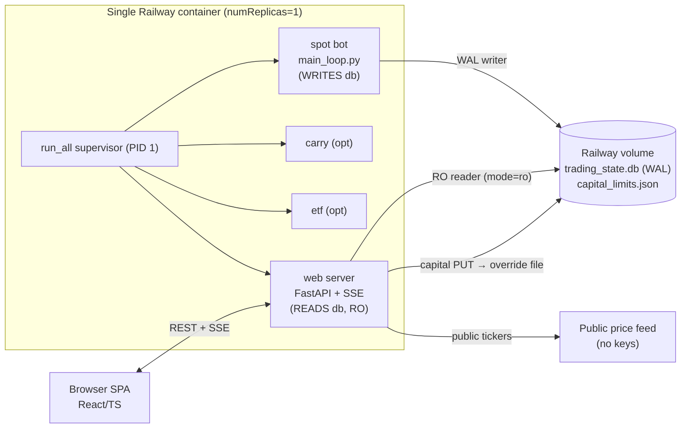

# ADR-001: Monitoring & Operations Dashboard for the Spot Trend-Following Bot

| | |
|---|---|
| **Status** | Proposed |
| **Date** | 2026-06-21 |
| **Author** | Architecture review |
| **Supersedes** | — |
| **Scope** | New read-heavy web dashboard co-located with the existing `src.run_all` supervisor. **No change to trading-loop or `RiskManager` logic.** |

---

## 1. Executive Summary

The bot today is a headless background worker (`src/run_all.py` → `src/main_loop.py`)
with full state in `trading_state.db` (SQLite, WAL) and structured logs to stdout. It
has **no operator visibility** beyond Telegram pings and Railway log tailing.

This ADR specifies a **read-only operations terminal**: a FastAPI service that reads the
same SQLite file (and public market prices) and serves a dark, professional, accessible
React/TypeScript SPA. It adds exactly **one new, non-conflicting table** (`equity_snapshots`)
written by a dedicated low-frequency sampler — never by the dashboard request path — and
**reuses the existing `CapitalSettingsService`** (`src/settings_service.py`) for the *only*
mutating action: adjusting the deployable-capital limit, which the trading loop already
hot-reloads via `RiskManager.maybe_reload_policy()`.

### Design pillars
1. **Zero trading risk.** The web process opens SQLite in **read-only URI mode** (`mode=ro`).
   It physically cannot write to `state`, `trades`, or `decisions`. The single allowed
   mutation (capital limit) goes through the *already-audited* settings service and an
   atomic JSON override file — the exact mechanism the bot was built to accept.
2. **Single service, single volume.** Add the web server as a fourth child of the existing
   supervisor (`RUN_BOTS` style), sharing the Railway volume that holds the DB. No second
   service, no data sync, no DB duplication.
3. **Explainability preserved and amplified.** Every risk gate, stop formula, and regime
   state from `RiskManager`/`main_loop` is surfaced with a plain-English + exact-math tooltip.
4. **Near-real-time, cheap.** Server-Sent Events (SSE) push deltas; the bot polls every
   900 s, so a 5–15 s dashboard refresh is already faster than the underlying truth changes.

### Success metrics
| Metric | Target |
|---|---|
| Writes to `state`/`trades`/`decisions` from web process | **0** (enforced by `mode=ro`) |
| Added latency/contention on the trading loop | **0 measurable** (WAL readers don't block the writer) |
| Time-to-first-paint (cached) | < 1.5 s |
| Domains covered with live endpoints | 7/7 (Overview, Positions, History, Decisions, Performance, Config, Health) |
| WCAG | AA (contrast, keyboard, ARIA, reduced-motion) |
| New runtime dependencies in the bot process | **0** (web deps are optional, lazy-imported) |

---

## 2. Domain Decomposition

The dashboard is organized into seven domains. Each maps to concrete DB reads and endpoints
(see §6). The DB is the contract; everything below is *derived* from the three existing
tables plus live prices.

| # | Domain | Primary source | Key derived/computed fields |
|---|---|---|---|
| 1 | **Overview / KPIs** | `state` + `trades(OPEN)` + live prices | equity, day/week return %, unrealized PnL, open count, win rate, mode badge, circuit-breaker status |
| 2 | **Open Positions (live MTM)** | `trades WHERE status='OPEN'` + prices | unrealized PnL $/%, distance-to-stop, R-multiple, % of per-asset cap, peak/drawdown-from-peak, chandelier stop |
| 3 | **Trade History** | `trades WHERE status='CLOSED'` | realized PnL, hold duration, return %, exit reason, mode, R-multiple, cumulative PnL |
| 4 | **Decisions log** | `decisions` | action, conviction, consulted-Claude flag, reasoning, joined to resulting trade (by symbol+time) |
| 5 | **Performance Analytics** | `equity_snapshots` + `trades` | equity curve, drawdown curve, max DD, win rate, profit factor, expectancy, per-coin attribution, regime-on/off split |
| 6 | **Config & Universe** | `load_config()` (read-only) + `CapitalSettingsService` | strategy params, universe, risk rails, capital policy (the **only** editable surface) + safe override *simulation* |
| 7 | **Bot Health & Logs** | `state` freshness + process signals + recent `decisions` | last-cycle timestamp, mode, regime status, alerts/circuit-breaker, DB write-age heartbeat, replica liveness |

> Every domain has an explicit empty / loading / error state (§8.5). The bot legitimately
> sits flat for days, so "no open positions" and "no trades yet" are first-class, not errors.

---

## 3. Tech Stack — Recommendation & Justification

### 3.1 Backend: **FastAPI + Uvicorn + Pydantic v2** (read-only SQLite via `sqlite3` URI)

**Why FastAPI specifically (not Flask, not Litestar):**
- The repo **already ships a FastAPI adapter** (`src/api/capital_settings_api.py`) with the
  exact `create_app(cfg)` factory pattern, lazy-imported so the bots stay dependency-light.
  We extend that file's sibling modules rather than introduce a new framework.
- Pydantic v2 is already a transitive dependency (FastAPI) and gives us typed, self-documenting
  response models + automatic OpenAPI docs at `/api/docs` for free.
- Native `async` + Starlette's `StreamingResponse` give first-class SSE with no extra library.
- Same Python runtime as the bot → shared `load_config()`, shared schema knowledge, one image.

**DB access:** raw `sqlite3` (stdlib), **not** an ORM. The schema is tiny (3 tables), fixed,
and we only read. An ORM adds migrations, models, and write surface we explicitly do not want.
We open with a read-only URI and a per-request short-lived connection (§5.2).

### 3.2 Frontend: **React 18 + TypeScript + Vite + TanStack Query + Tailwind + Recharts**

This is the decision the task asks us to defend with a real comparison.

#### Option A — Server-rendered Python (HTMX + Jinja, or Streamlit/Plotly Dash)
- ✅ One language, fewer moving parts, no Node build, trivially co-located.
- ✅ Streamlit/Dash get you charts in hours.
- ❌ **Ceiling on UX.** Streamlit/Dash are analyst tools — they cannot deliver a virtualized
  trade table, restrained custom animation, mobile-first density, fine-grained skeletons, or a
  bespoke dark trading theme without fighting the framework. HTMX can, but you end up
  hand-rolling the interactive table/charting layer anyway.
- ❌ Accessibility (WCAG AA, focus management, ARIA live regions for SSE) is manual and brittle.
- ❌ Real-time = full-fragment swaps or websocket hacks; awkward for fine deltas.

#### Option B — React + TypeScript SPA (recommended) ✅
- ✅ **Highest achievable UI/UX**, which is an explicit success criterion: virtualized tables
  (`@tanstack/react-virtual`), Recharts for equity/drawdown, Radix UI primitives for
  WCAG-AA tooltips/dialogs/tabs with correct focus + ARIA out of the box.
- ✅ **TanStack Query** is purpose-built for read-heavy dashboards: caching, background
  refetch, stale-while-revalidate, and an `EventSource` → `queryClient.setQueryData` bridge
  for SSE deltas (optimistic-feeling without optimistic writes, since we're read-only).
- ✅ Full type safety end-to-end: generate the TS client from FastAPI's OpenAPI schema
  (`openapi-typescript`) so backend Pydantic models and frontend types **cannot drift**.
- ✅ Vite builds to static assets; FastAPI serves them from `/` via `StaticFiles`. Still one
  service, one container, one port.
- ⚠️ Cost: a Node build step in Docker (multi-stage) and a second toolchain. Acceptable and
  well-trodden; mitigated by a multi-stage Dockerfile that ships only the built `dist/`.

**Verdict:** **Option B.** The brief demands an "industry-leading," "professional trading
operations terminal" with virtualized tables, accessibility, mobile-first density, and
restrained motion. Only the React/TS path reaches that bar; the Python-native options cap out
well below it. The drift risk (two languages) is neutralized by OpenAPI-generated types.

| Concern | Choice | Rationale |
|---|---|---|
| Backend framework | FastAPI | Already in repo; async SSE; OpenAPI; Pydantic typing |
| DB access | stdlib `sqlite3`, read-only URI | No write surface; no migration burden |
| Server state / fetching | TanStack Query v5 | SWR cache, background refetch, SSE bridge |
| Real-time | SSE (`text/event-stream`) | Simplest reliable push; auto-reconnect; HTTP/1.1-friendly on Railway |
| Charts | Recharts | Declarative, accessible, themeable; equity/DD/attribution |
| Tables | TanStack Table + react-virtual | Virtualized 10k+ rows, sortable, filterable |
| Styling/theme | Tailwind + CSS vars | Dark trading theme, tokenized, fast |
| UI primitives | Radix UI | WCAG-AA dialogs/tooltips/tabs, focus mgmt |
| Client typegen | openapi-typescript | Backend↔frontend types can't drift |
| Lightweight UI state | Zustand (optional) | Filters/theme toggles only; server state stays in Query |

---

## 4. Integration Strategy with the Existing Bot

**Principle: the web layer imports *read-only helpers and config*, never the live `RiskManager`
instance the loop is mutating.** They communicate only through the durable DB file and the
settings override file — the same boundaries the bot already uses across its sibling processes.

### 4.1 What the web layer imports
- `src.config.load_config` — to render config and resolve `db_path`, `quote_ccy`, mode flags.
  (Pure function, no side effects beyond `load_dotenv`.)
- `src.settings_service.CapitalSettingsService` — for the capital-limit GET/PUT (already
  frontend-ready, already audited, already hot-reloaded by the loop).
- `src.capital_policy.DeployableCapitalPolicy` + `CAPITAL_POLICY_SCHEMA` — to *simulate*
  "remaining capacity" given the same `remaining_capacity(equity, available_quote, open_value)`
  math the `RiskManager` uses, **without** touching the live instance.

### 4.2 What it does NOT do
- It never constructs `RiskManager`, `SpotExecutor`, `DataPipeline`, or `TradingBot`.
- It never calls `record_open/close`, `_set`, `update_trail`, or any method that writes.
- It never places, cancels, or simulates orders against a venue.

### 4.3 Price feed: public, independent
For live mark-to-market the dashboard needs current prices. Two tiers, in order:
1. **Bot-derived (preferred, zero extra calls):** the new `equity_snapshots` sampler (a tiny
   read-only loop in the *web* process) records the latest equity each minute; the Overview
   reuses last-known prices embedded there. For per-position MTM we need spot prices, so:
2. **Public price feed (read-only):** a small `MarketDataClient` calls the **public** ticker
   endpoints (Alpaca market-data or Binance.US public `/ticker/price`) — **no API keys, no
   account, no order surface**. Cached 10 s, batched per base asset, with graceful staleness
   badges. This deliberately mirrors `main_loop._all_prices()` semantics (price per base
   asset) without importing the bot's authenticated `DataPipeline`.



---

## 5. Data Models & DB Access Layer

### 5.1 Existing schema (authoritative — from `RiskManager._init_db`)
```sql
state(key TEXT PRIMARY KEY, value TEXT)
trades(id, symbol, opened_at, closed_at, entry_price, exit_price, qty, cost_usd,
       entry_fee, exit_fee, stop_price, take_price, current_stop, peak_price,
       stop_order_id, pnl_usd, status, mode, reason)
decisions(id, ts, symbol, action, conviction, consulted_claude, reasoning)
```
Relevant `state` keys: `paper_cash`, `day_date`, `day_start_equity`, `week_id`,
`week_start_equity`, `consecutive_losses`, `wins`, `losses`, `last_close_ts:{SYMBOL}`,
`last_rotation_day`.

### 5.2 Read-only DB access design

```python
# web/db.py
import sqlite3
from pathlib import Path
from contextlib import contextmanager

class ReadOnlyDB:
    """Per-request, read-only SQLite access. Opening with mode=ro makes writes
    physically impossible (sqlite returns SQLITE_READONLY). WAL lets us read with
    zero contention while the bot writes."""

    def __init__(self, db_path: str) -> None:
        # immutable=0: file is being written by the bot, so we must see new commits.
        self._uri = f"file:{Path(db_path).as_posix()}?mode=ro"

    @contextmanager
    def conn(self):
        c = sqlite3.connect(self._uri, uri=True, check_same_thread=False, timeout=5.0)
        c.row_factory = sqlite3.Row
        try:
            c.execute("PRAGMA query_only=ON")     # belt-and-suspenders
            c.execute("PRAGMA busy_timeout=5000") # never block the writer
            yield c
        finally:
            c.close()
```

**Why per-request connections, not a pool:** SQLite connections are cheap; readers under WAL
never block the single writer (the bot) and are never blocked by it. A short-lived RO
connection sidesteps thread-affinity and stale-snapshot issues entirely. Endpoints that fan
out multiple queries reuse one `conn()` context.

**Concurrency guarantee:** WAL mode (already set by the bot) permits N concurrent readers + 1
writer. The web process is a pure reader → it **cannot** cause `database is locked` for the
bot, and `busy_timeout` covers the rare checkpoint window. This is the crux of the
"zero trading risk" claim and is enforced at the SQLite layer, not by convention.

### 5.3 New table: `equity_snapshots` (justified, written only by the web sampler)
The bot stores only *current* scalars in `state`; there is **no historical equity series**,
so an equity curve / drawdown chart is impossible from existing data. We add one append-only
table, written by a dedicated sampler **inside the web process** (never on the request path,
never by the bot):

```sql
CREATE TABLE IF NOT EXISTS equity_snapshots (
  id INTEGER PRIMARY KEY AUTOINCREMENT,
  ts TEXT NOT NULL,            -- ISO-8601 UTC
  equity REAL NOT NULL,        -- marked-to-market account value
  open_value REAL NOT NULL,    -- sum of open positions at mark
  cash REAL NOT NULL,          -- paper_cash or broker quote balance
  open_positions INTEGER NOT NULL,
  day_return_pct REAL, week_return_pct REAL,
  regime_on INTEGER,           -- 1/0/NULL: BTC regime at sample time
  mode TEXT                    -- PAPER / PAPER-BROKER / LIVE
);
CREATE INDEX IF NOT EXISTS idx_equity_ts ON equity_snapshots(ts);
```

**Why this is safe despite being a write:** it is a *separate table the bot never reads or
writes*. The sampler uses its own normal (read-write) connection to a different logical
concern; it can never alter `state`/`trades`/`decisions`. If the sampler dies, the live
dashboard still works — only the historical curve stops extending. Sample cadence: 60 s
(configurable), plus an immediate sample whenever a `trades` row changes status (detected by
polling `MAX(id)` / open-set hash). This keeps the curve faithful without coupling to the bot.

> **Alternative considered & rejected:** have the *bot* write snapshots. Rejected — it would
> require editing `main_loop`/`RiskManager`, violating the "zero changes to trading logic"
> constraint. The independent sampler achieves the same data with no bot edits.

### 5.4 Pydantic v2 response models (representative)

```python
# web/models.py  (all models: from __future__ import annotations; ConfigDict(frozen=True))
from pydantic import BaseModel, Field
from datetime import datetime

class ModeBadge(BaseModel):
    mode: str                         # "PAPER" | "PAPER-BROKER" | "LIVE"
    real_money: bool
    exchange_id: str

class OpenPosition(BaseModel):
    id: int
    symbol: str
    opened_at: datetime
    entry_price: float
    qty: float
    cost_usd: float
    current_stop: float
    peak_price: float
    # ---- computed (server-side, from live price) ----
    last_price: float
    market_value: float               # qty * last_price
    unrealized_pnl_usd: float         # market_value - cost_usd (paper) / vs entry
    unrealized_pnl_pct: float
    distance_to_stop_pct: float       # (last_price - current_stop) / last_price
    r_multiple: float                 # (last_price-entry)/(entry-initial_stop)
    drawdown_from_peak_pct: float
    pct_of_per_asset_cap: float       # market_value / (equity * per_asset_alloc_pct)
    price_is_stale: bool

class ClosedTrade(BaseModel):
    id: int
    symbol: str
    opened_at: datetime
    closed_at: datetime
    entry_price: float
    exit_price: float
    qty: float
    pnl_usd: float
    return_pct: float                 # computed
    hold_hours: float                 # computed
    mode: str
    reason: str

class Decision(BaseModel):
    id: int
    ts: datetime
    symbol: str | None
    action: str
    conviction: int
    consulted_claude: bool
    reasoning: str

class RiskGauges(BaseModel):
    """Mirrors RiskManager.can_open_trade gates as progress-bar values 0..1."""
    daily_loss: GaugeValue            # current vs daily_loss_limit_pct
    weekly_loss: GaugeValue
    consecutive_losses: GaugeValue    # current vs max_consecutive_losses
    trades_today: GaugeValue          # current vs max_trades_per_day
    concurrent_positions: GaugeValue  # open vs max_concurrent_positions
    total_exposure: GaugeValue        # open_value vs capital_policy.remaining_capacity
    circuit_breaker_tripped: bool
    regime_on: bool | None

class GaugeValue(BaseModel):
    label: str
    current: float
    limit: float
    pct_of_limit: float = Field(ge=0)
    breached: bool
    tooltip_plain: str                # "Trading pauses for the day after -3% equity."
    tooltip_math: str                 # "(equity - day_start)/day_start ≤ -0.03"

class KpiSummary(BaseModel):
    mode: ModeBadge
    equity: float
    cash: float
    open_value: float
    unrealized_pnl_usd: float
    day_return_pct: float
    week_return_pct: float
    pnl_today_usd: float
    open_positions: int
    wins: int; losses: int
    win_rate_pct: float
    consecutive_losses: int
    as_of: datetime
    price_age_seconds: float

class HealthStatus(BaseModel):
    status: str                       # "healthy" | "degraded" | "stale"
    last_db_write_age_seconds: float  # age of newest decisions/trades/state change
    last_decision_at: datetime | None
    poll_seconds: int                 # expected cadence from config
    expected_next_cycle_by: datetime
    regime_on: bool | None
    circuit_breaker_tripped: bool
    db_size_bytes: int
```

`KpiSummary`, `RiskGauges`, and `daily_stats` deliberately reproduce the exact fields and
formulas in `RiskManager.daily_stats()` and `can_open_trade()` so numbers on the dashboard are
identical to the bot's own — single source of truth, re-derived read-only.

---

## 6. API Contract

Base path: `/api`. Static SPA served from `/`. Interactive docs at `/api/docs` (FastAPI).
All responses `application/json`; errors use a uniform `{ "error": { "code", "message" } }`.

### 6.1 Auth & rate limiting
- **Auth:** optional bearer token via `DASHBOARD_TOKEN` env. If set, all `/api/*` require
  `Authorization: Bearer <token>`; if unset, open (internal use). The capital **PUT** *always*
  requires the token even in open mode (fail-closed on the only mutation). The SPA stores the
  token in memory (not localStorage) and prompts once.
- **Rate limiting:** in-process token bucket (e.g. `slowapi`) — 60 req/min/IP for reads,
  **5 req/min/IP** for the capital PUT. SSE connections capped (e.g. 20).
- **CORS:** locked to the dashboard origin via `DASHBOARD_ALLOWED_ORIGINS` (default same-origin).

### 6.2 Endpoint catalogue

| Method | Path | Purpose | Auth | Notes |
|---|---|---|---|---|
| GET | `/api/health` | Liveness + DB write-age + cadence | none | Also Railway healthcheck |
| GET | `/api/summary` | `KpiSummary` for the Overview header | token* | Live prices, cached 5 s |
| GET | `/api/positions` | Open positions with live MTM | token* | `OpenPosition[]` |
| GET | `/api/trades` | Closed trades, paginated/filtered | token* | See params below |
| GET | `/api/trades/{id}` | One trade + linked decisions | token* | Detail drawer |
| GET | `/api/decisions` | Strategy decision log, paginated | token* | filter by symbol/action |
| GET | `/api/performance/equity` | Equity + drawdown series | token* | from `equity_snapshots`; `?range=` |
| GET | `/api/performance/stats` | Win rate, profit factor, expectancy, max DD | token* | computed from `trades` |
| GET | `/api/performance/attribution` | Realized PnL per coin | token* | grouped by base asset |
| GET | `/api/performance/regime` | PnL split: regime-on vs off | token* | joins snapshots↔trades by time |
| GET | `/api/risk` | `RiskGauges` (all circuit breakers) | token* | mirrors `can_open_trade` |
| GET | `/api/config` | Read-only effective config + universe | token* | redacts secrets (§7) |
| GET | `/api/capital-limits` | Effective capital policy (all sleeves) | token* | reuse `CapitalSettingsService.get_all()` |
| GET | `/api/capital-limits/schema` | Form metadata | token* | reuse `CAPITAL_POLICY_SCHEMA` |
| POST | `/api/capital-limits/{sleeve}/simulate` | Dry-run a policy → remaining capacity, no write | token* | safe override simulation |
| **PUT** | `/api/capital-limits/{sleeve}` | **Persist** new capital policy | **token (always)** | reuse `service.update(...)`, audited |
| GET | `/api/stream` | SSE: positions/equity/decisions/risk/health | token* | `text/event-stream` |

\* required only when `DASHBOARD_TOKEN` is set.

### 6.3 Pagination & filtering (`/api/trades`, `/api/decisions`)
```
?limit=50          (1..200, default 50)
&cursor=<id>       keyset pagination on id DESC (stable, index-friendly)
&symbol=BTC/USDT   exact match
&status=CLOSED     trades only
&action=BUY        decisions only
&from=2026-01-01&to=2026-06-21   ISO date range on closed_at / ts
&sort=closed_at:desc
```
Response envelope:
```json
{ "items": [ ... ], "next_cursor": 1423, "has_more": true, "total_estimate": 5120 }
```
Keyset (not OFFSET) so deep history stays O(log n) on the autoincrement PK / `idx` indexes.

### 6.4 Example: `GET /api/positions`
```json
[
  {
    "id": 142, "symbol": "BTC/USDT", "opened_at": "2026-06-18T00:00:00Z",
    "entry_price": 64210.0, "qty": 0.00351, "cost_usd": 225.4,
    "current_stop": 61050.0, "peak_price": 66120.0,
    "last_price": 65340.0, "market_value": 229.34,
    "unrealized_pnl_usd": 3.94, "unrealized_pnl_pct": 1.75,
    "distance_to_stop_pct": 6.56, "r_multiple": 0.36,
    "drawdown_from_peak_pct": 1.18, "pct_of_per_asset_cap": 30.6,
    "price_is_stale": false
  }
]
```

### 6.5 Example: `PUT /api/capital-limits/spot` (the only mutation)
Request:
```json
{ "max_usd": 1000.0, "basis": "equity", "precedence": "min" }
```
Behavior: delegates verbatim to `CapitalSettingsService.update(payload, sleeve="spot",
actor="dashboard:<user|token-id>")`. On success the override file is atomically rewritten and
**the running bot picks it up on its next cycle** via `RiskManager.maybe_reload_policy()` — no
restart, no bot edit. Response includes `saved`, `shadowed_by_env`, and the audit is appended
to `config/capital_limits_audit.log` (existing behavior). Validation failure → `422` with the
service's structured `errors`.

---

## 7. Real-Time Architecture (SSE)

**Mechanism:** a single SSE endpoint `GET /api/stream`. The browser uses `EventSource`
(auto-reconnect, `Last-Event-ID` resume). Chosen over WebSockets because the data flow is
**server→client only**, SSE survives proxies/Railway edge cleanly over HTTP/1.1, and reconnect
is built in. (WebSockets are noted as a future upgrade if bidirectional control is ever added —
it is explicitly out of scope here.)

### 7.1 Event types
| `event:` | Payload | Emitted when |
|---|---|---|
| `summary_update` | `KpiSummary` | every 5 s (price tick) |
| `positions_update` | `OpenPosition[]` | every 5 s, or on open-set change |
| `equity_update` | `{ts, equity, drawdown_pct}` | on each `equity_snapshots` sample (~60 s) |
| `new_trade` | `ClosedTrade` or open `trade` | `MAX(trades.id)` or status change observed |
| `new_decision` | `Decision` | `MAX(decisions.id)` increases |
| `risk_alert` | `{kind, message, gauge}` | circuit breaker trips / loss limit / regime flip |
| `health` | `HealthStatus` | every 15 s heartbeat |

### 7.2 Server implementation sketch
```python
@router.get("/api/stream")
async def stream(request: Request):
    async def gen():
        watermarks = Watermarks()       # last seen trade id, decision id, snapshot ts
        while not await request.is_disconnected():
            for ev in poll_for_changes(db, watermarks, prices):  # RO queries
                yield sse_format(ev.event, ev.id, ev.json)
            yield ": keepalive\n\n"      # comment ping defeats idle proxies
            await asyncio.sleep(SSE_TICK_SECONDS)  # default 5 s
    return StreamingResponse(gen(), media_type="text/event-stream",
        headers={"Cache-Control": "no-cache", "X-Accel-Buffering": "no"})
```
Detection is **diff-by-watermark** on RO queries (`MAX(id)`, open-set hash, latest snapshot
ts) — no triggers, no bot coupling, no writes.

### 7.3 Fallback polling
The client treats SSE as an *accelerator*, not a dependency. TanStack Query keeps a
`refetchInterval` (15 s for summary/positions, 30 s for risk/health, off for static config). If
`EventSource` errors or the tab backgrounds, the UI degrades to polling with a small "live →
polling" indicator. No data is ever *only* available via SSE.

---

## 8. UI / UX Specification

### 8.1 Global frame
- **Top bar:** product name · **MODE BADGE** (PAPER green / PAPER-BROKER amber / **LIVE red,
  pulsing dot**) · exchange · live equity + day return % (color-coded) · connection status
  (live/polling/offline) · last-update age · theme/density toggle.
- **Left nav (collapsible, icon rail on mobile):** Overview · Positions · History · Decisions ·
  Performance · Risk · Config · Health.
- **Theme:** dark trading palette via CSS variables — base `#0B0E11`, surface `#151A21`,
  positive `#16C784`, negative `#EA3943`, warning `#F0B90B`, text `#E6E8EB`/muted `#8A93A2`.
  All pairs verified ≥ 4.5:1 (AA). A light theme is provided but dark is default.
- **Density:** "comfortable"/"compact" toggle (row height) persisted in `localStorage`.

### 8.2 Pages & wireframes (textual)

**Overview** — `flex` KPI strip (Equity, Day %, Week %, Unrealized PnL, Open, Win rate,
Circuit-breaker chip), then a two-column grid: left = **equity sparkline → full curve** card +
**risk gauges** (horizontal progress bars, fill turns red near limit); right = **open positions
mini-table** + **regime status** card (RISK-ON/RISK-OFF with BTC vs MA tooltip) + **recent
decisions** feed. Empty state when flat: a calm "Bot is flat — watching N coins for breakouts"
panel with the universe chips, *not* an error.

```
┌──────────────────────────────────────────────────────────────────────┐
│ [PAPER]  Binance.US · spot      Equity $1,024.18  ▲+0.42% day  ● live  │
├───────────────┬──────────────────────────────────────────────────────┤
│ Equity $1,024 │ Day ▲0.42% │ Week ▲1.9% │ uPnL +$3.9 │ Open 1 │ Win 58%│
├───────────────┴──────────────────────────────────────────────────────┤
│ ┌ Equity curve ───────────────┐  ┌ Open positions ──────────────────┐ │
│ │       /\      /\___          │  │ BTC  +1.75%  stop 6.6% away  …    │ │
│ │   ___/  \____/               │  └──────────────────────────────────┘ │
│ └──────────────────────────────┘  ┌ Regime ───────────┐ ┌ Decisions ─┐ │
│ ┌ Risk gauges ─────────────────┐  │ RISK-ON (BTC>MA100)│ │ HOLD ETH … │ │
│ │ Daily loss   ▓▓░░░░ 0.4/3.0% │  └────────────────────┘ │ BUY  BTC … │ │
│ │ Concurrent   ▓▓░░░░ 1/3      │                         └────────────┘ │
│ └──────────────────────────────┘                                       │
└──────────────────────────────────────────────────────────────────────┘
```

**Positions** — virtualized table: Symbol · Entry · Last · Qty · Mkt value · uPnL $/% ·
**Distance-to-stop bar** · R-multiple · % of cap · Age. Row → detail drawer (price vs
entry/stop/peak chart, trade timeline, the chandelier formula tooltip). Color-coded PnL;
distance-to-stop rendered as a small bar that reddens as price nears `current_stop`.

**History** — virtualized, filterable (symbol, date range, win/loss, mode), sortable. Columns:
Closed · Symbol · Hold · Entry→Exit · Return % · PnL $ · R · Reason · Mode. Footer aggregates
(count, total PnL, win rate for the current filter). CSV export of the filtered set.

**Decisions** — chronological feed; each card: timestamp · symbol · action chip (BUY/HOLD/SELL)
· conviction dots · "🧠 Claude consulted" badge · full reasoning text. Filter by symbol/action.
Links to the resulting trade when one followed.

**Performance** — equity curve + **underwater (drawdown) chart**, stat cards (Max DD, win rate,
profit factor, expectancy, avg win/loss, avg hold), **per-coin attribution bar chart**, and a
**regime split** (PnL & win rate when regime-on vs off) that directly visualizes the value of
the BTC filter. Range selector (7D/30D/90D/All).

**Risk** — full-page gauge board, one card per gate in `can_open_trade`, each with: current vs
limit, a progress bar, breached/ok state, and the dual tooltip (plain + math). A prominent
**Circuit-Breaker** panel (consecutive losses vs `max_consecutive_losses`) that goes solid red
and explains "trading paused" when tripped, mirroring `main_loop`'s `_cb_notified` behavior.

**Config** — read-only accordion of the effective config (strategy/donchian, regime, risk
rails, portfolio caps, universe chips), **secrets redacted**. One **editable** card: the
**Deployable-Capital Limit** with the schema-driven form (`/capital-limits/schema`), a live
**"Simulate"** button (calls `/simulate`, shows resulting remaining-capacity vs current
exposure with no write), a **confirmation modal** before PUT, a `shadowed_by_env` warning if an
env var overrides it, and the source badge (env/override/yaml/legacy).

**Health** — last-cycle/last-write age (green<2×poll, amber<4×, red beyond), expected next
cycle, mode, regime, circuit-breaker, DB size, SSE status, and a tail of recent log-style
events derived from the decisions/trades stream (the dashboard does not read container stdout;
it reconstructs activity from the DB).

### 8.3 Educational tooltips (a first-class requirement)
Every strategy/risk term gets a Radix `Tooltip`/`Popover` with two registers:
- **Plain English:** e.g. *Chandelier stop* — "We exit if price falls a set distance below the
  highest price reached since entry, so winners are given room but losses are capped."
- **Exact math:** `stop = peak − 3 × ATR₁₄` (pulls `atr_trail_mult` from config so the tooltip
  shows the *actual configured* multiplier, not a hardcoded 3). Donchian: `entry when close >
  max(high, 40)`. Daily loss limit: `(equity − day_start)/day_start ≤ −0.03`. Per-asset cap:
  `position ≤ equity × 0.30`.
A central `glossary.ts` maps term → `{plain, math}`; tooltips are keyboard-focusable and
screen-reader-announced.

### 8.4 Accessibility (WCAG AA)
- All interactive elements keyboard-reachable; visible focus rings; logical tab order.
- Radix primitives give correct ARIA roles, focus trapping in dialogs, ESC-to-close.
- SSE-driven updates announced via an `aria-live="polite"` region (e.g. "BTC stop raised").
- Color never the sole signal — PnL pairs color with ▲/▼ and sign; gauges with text values.
- `prefers-reduced-motion` disables the LIVE pulse and chart transitions.
- Contrast ≥ 4.5:1 (text) / 3:1 (UI) verified for every token pair.

### 8.5 States, performance, motion
- **Skeletons** for every card/table on first load (not spinners).
- **Empty states** are designed, calm, and explain *why* it's empty (flat by design).
- **Error states** per-card with retry; one failed endpoint never blanks the page.
- **Virtualized** History/Positions tables (react-virtual) handle 10k+ rows at 60fps.
- **Stale-while-revalidate** via TanStack Query; SSE deltas patch the cache so updates feel
  instant without optimistic *writes* (there are none to be optimistic about).
- **Restrained motion:** number roll-ups on KPI change, gentle row highlight on new
  trade/decision, smooth gauge fills. No confetti, no gamification — it's an ops terminal.

---

## 9. Security, Observability, Performance

### 9.1 Security
- **Read-only by construction:** `mode=ro` + `PRAGMA query_only` on every web DB connection.
  The web process cannot write the trading tables even if a bug tried to.
- **Single mutation, fully audited:** capital PUT → `CapitalSettingsService` (atomic write +
  audit log + validation). Always token-gated, rate-limited to 5/min, behind a confirm modal.
- **Secret redaction:** `/api/config` strips `api_key`, `api_secret`, `anthropic_api_key`,
  `telegram_token`, `telegram_chat_id` (anything under `runtime` matching `*_key|*_secret|
  token`). A unit test asserts no secret substring ever appears in the response.
- **Token auth** (`DASHBOARD_TOKEN`), **CORS allowlist**, security headers (CSP allowing only
  self + the SPA bundle, `X-Content-Type-Options`, `Referrer-Policy`).
- **No order surface** anywhere in the web package — verified by a test asserting the web
  package never imports `SpotExecutor`/`build_exchange`/broker modules.

### 9.2 Observability
- Structured request logging (loguru, matching the bot's format) with latency + status.
- `/api/health` doubles as the Railway healthcheck and exposes DB write-age (detects a
  silently dead bot: writes stop → health goes `stale`).
- Optional Prometheus `/metrics` (request counts/latency, SSE clients, price-feed staleness,
  snapshot lag) — additive, off by default.

### 9.3 Performance
- Indices: existing PK on `trades.id`/`decisions.id` + new `idx_equity_ts`. Add (read-only,
  via the sampler's RW conn at startup) `idx_trades_status`, `idx_trades_closed_at`,
  `idx_decisions_ts` to keep history/decision queries index-only. *These are additive indices
  on existing tables — they change no data and are created once, guarded by `IF NOT EXISTS`.*
  (If touching the bot's tables for indices is deemed too invasive, the alternative is to keep
  them off and rely on keyset pagination, which is already O(log n) on the PK.)
- 5–10 s server-side cache on price-derived endpoints collapses fan-out under many viewers.
- Equity series downsampled server-side for long ranges (LTTB) so charts stay light on mobile.

---

## 10. Project Structure

A new top-level `web/` package (mirrors the `src/` layout, imports only the read-only helpers
named in §4.1). Frontend under `web/frontend/`.

```
bitcon-trads/
├── src/                      # UNCHANGED trading code
│   ├── main_loop.py  risk_manager.py  config.py  run_all.py
│   ├── settings_service.py  capital_policy.py
│   └── api/capital_settings_api.py        # existing FastAPI pattern (reused)
├── web/                      # NEW — read-only dashboard backend
│   ├── __init__.py
│   ├── server.py             # create_app(): mounts API + SSE + static SPA
│   ├── deps.py               # config, token auth, db handle, price client (DI)
│   ├── db.py                 # ReadOnlyDB (mode=ro)
│   ├── models.py             # Pydantic v2 response models (§5.4)
│   ├── queries.py            # all SQL (read-only) + computed fields
│   ├── prices.py             # MarketDataClient (public feed, no keys)
│   ├── snapshots.py          # equity_snapshots sampler (own RW conn, separate table)
│   ├── stream.py             # SSE generator + watermark diffing
│   ├── security.py           # token auth, CORS, redaction, rate limit
│   ├── main.py               # `python -m web.main` → uvicorn (new run_all child)
│   └── routers/
│       ├── summary.py  positions.py  trades.py  decisions.py
│       ├── performance.py  risk.py  config.py  capital.py  health.py
├── web/frontend/             # NEW — React + TS SPA
│   ├── index.html  vite.config.ts  tailwind.config.ts  tsconfig.json
│   ├── package.json
│   └── src/
│       ├── main.tsx  App.tsx
│       ├── api/{client.ts, types.gen.ts(openapi), sse.ts}
│       ├── theme/{tokens.css, glossary.ts}
│       ├── components/{ModeBadge, RiskGauge, EquityChart, DrawdownChart,
│       │              VirtualTable, Tooltip, KpiStat, EmptyState, Skeleton}
│       ├── pages/{Overview, Positions, History, Decisions,
│       │          Performance, Risk, Config, Health}.tsx
│       └── hooks/{useSummary, usePositions, useStream, useTrades}.ts
├── tests/
│   ├── test_web_readonly.py     # asserts mode=ro blocks writes; no executor import
│   ├── test_web_queries.py      # computed fields vs RiskManager math (sample DB)
│   ├── test_web_redaction.py    # no secret ever in /api/config
│   └── test_web_endpoints.py    # FastAPI TestClient over a seeded DB
├── requirements-web.txt         # fastapi uvicorn slowapi (web-only, optional)
├── Dockerfile                   # + multi-stage frontend build (see §11)
└── railway.json                 # + healthcheckPath, PORT (see §11)
```

---

## 11. Railway Deployment Plan

**Model: single service, single container, single volume** — the web server becomes a fourth
child of the existing `run_all` supervisor (or runs alongside via a one-line supervisor entry),
sharing the volume-mounted `trading_state.db`. This is strictly simpler and safer than a
second service (no DB sync, no cross-service file sharing, WAL handles reader+writer).

### 11.1 Supervisor: add `web` as a known child
`src/run_all.py` `BOTS` dict gains one entry (additive, default unchanged):
```python
BOTS = {
    "spot": "src.main_loop",
    "carry": "src.carry.main",
    "etf": "src.etf.main",
    "web": "web.main",          # NEW: read-only dashboard (uvicorn)
}
```
`RUN_BOTS=spot,web` runs the bot + dashboard in one container. Default stays `spot`, so
existing deploys are untouched until the operator opts in. (The web child is a pure reader; a
crash/restart of it can never affect the trading children — the supervisor already isolates
each child with capped backoff.)

### 11.2 `web/main.py`
```python
import os, uvicorn
from web.server import create_app
from src.config import load_config

def main() -> None:
    app = create_app(load_config())
    uvicorn.run(app, host="0.0.0.0", port=int(os.getenv("PORT", "8080")), log_level="info")

if __name__ == "__main__":
    main()
```

### 11.3 Dockerfile — multi-stage (frontend build, then unchanged Python image)
Add a frontend build stage; the Python stage is **identical to today** plus copying built
assets and the optional web requirements. The default `CMD` and `RUN_BOTS=spot` are unchanged.
```dockerfile
# --- Stage 1: build the SPA ---
FROM node:20-slim AS frontend
WORKDIR /ui
COPY web/frontend/package*.json ./
RUN npm ci
COPY web/frontend/ ./
RUN npm run build           # -> /ui/dist

# --- Stage 2: Python runtime (unchanged base) ---
FROM python:3.12-slim
ENV PYTHONDONTWRITEBYTECODE=1 PYTHONUNBUFFERED=1 PYTHONFAULTHANDLER=1 PIP_NO_CACHE_DIR=1
WORKDIR /app
COPY requirements.txt requirements-etf.txt requirements-web.txt ./
RUN pip install --no-cache-dir -r requirements.txt -r requirements-etf.txt -r requirements-web.txt
COPY . .
COPY --from=frontend /ui/dist ./web/frontend/dist     # FastAPI StaticFiles mounts this
ENV PAPER_TRADING=true LIVE_TRADING_ENABLED=false RUN_BOTS=spot PORT=8080
STOPSIGNAL SIGTERM
CMD ["python", "-m", "src.run_all"]
```
> If the operator wants the dashboard, they set `RUN_BOTS=spot,web` in Railway Variables. The
> web requirements are isolated in `requirements-web.txt`; the trading process never imports
> them.

### 11.4 `railway.json` — add port + healthcheck (volume via Railway UI)
```json
{
  "$schema": "https://railway.app/railway.schema.json",
  "build": { "builder": "DOCKERFILE", "dockerfilePath": "Dockerfile" },
  "deploy": {
    "restartPolicyType": "ON_FAILURE",
    "restartPolicyMaxRetries": 10,
    "numReplicas": 1,
    "healthcheckPath": "/api/health",
    "healthcheckTimeout": 30
  }
}
```
- **Volume:** attach a Railway volume mounted at `/app` (or set `DB_PATH=/data/trading_state.db`
  and mount the volume at `/data`). The DB and `config/capital_limits.json` must live on the
  persistent volume so both the bot and web see the same files. **`numReplicas` stays 1** — the
  existing critical constraint; a second replica would duplicate the bot *and* split the DB.
- **Env strategy:** trading env vars unchanged. New web-only vars: `PORT`, `DASHBOARD_TOKEN`,
  `DASHBOARD_ALLOWED_ORIGINS`, `EQUITY_SNAPSHOT_SECONDS`. None affect the bot.

### 11.5 Single vs two-service — decision
**Chosen: single service.** SQLite is a file; cross-service file sharing on Railway means a
shared volume the *bot* writes and a *second* service reads — but two services cannot reliably
share one volume on Railway, forcing DB replication/streaming (litestream, etc.) for marginal
benefit. Co-location with WAL gives correct reader/writer semantics for free. A two-service
split is only justified if the web tier must scale horizontally (it doesn't — reads are cached
and cheap) or be deployed independently (a minor convenience not worth the data-sync cost).

---

## 12. Testing Strategy

| Layer | Tool | What it proves |
|---|---|---|
| **RO safety** | pytest | Opening `mode=ro` + attempting `INSERT/UPDATE` on `trades/state/decisions` raises `OperationalError`. Web package import graph contains no executor/broker module. |
| **Query/computation** | pytest + seeded sample DB | Computed fields (uPnL, R-multiple, day/week return, win rate, gauges) match `RiskManager.daily_stats()`/`can_open_trade()` on identical inputs. |
| **Redaction** | pytest | No secret value appears in `/api/config` for any config shape. |
| **API contract** | FastAPI `TestClient` | Status codes, pagination cursors, filters, auth (401 without token when set), 422 on bad capital PUT, 5/min rate limit on PUT. |
| **SSE** | httpx stream | Events emit on watermark advance; keepalive sent; disconnect handled. |
| **Capital PUT integration** | pytest | PUT routes through `CapitalSettingsService.update`, writes override file atomically, appends audit line, never mutates trading tables. Then assert `RiskManager(cfg).maybe_reload_policy()` picks it up. |
| **Frontend unit/component** | Vitest + Testing Library | RiskGauge breach styling, ModeBadge colors, EmptyState rendering, tooltip a11y roles. |
| **Frontend E2E** | Playwright | Boot SPA against a FastAPI TestServer over a fixture DB: load each page, filter history, open a position drawer, run a capital *simulate*, verify keyboard nav + focus + `aria-live`. |
| **Accessibility** | axe-core (in Playwright) | Zero AA violations on each page; reduced-motion honored. |

Fixtures: a `seed_sample_db()` helper builds a `trading_state.db` with realistic open/closed
trades, decisions, and snapshots so backend and E2E share one source of truth.

---

## 13. Migration & Rollback

- **Migration:** purely additive. Ship `web/`, `requirements-web.txt`, the multi-stage
  Dockerfile, and the `BOTS["web"]` entry. Until an operator sets `RUN_BOTS=spot,web`, **nothing
  changes** — the bot runs exactly as before. First enablement also creates `equity_snapshots`
  (idempotent `CREATE TABLE IF NOT EXISTS`) and additive indices.
- **Rollback:** set `RUN_BOTS=spot` (or revert the Docker/railway diff). The dashboard
  disappears; the bot is unaffected; the extra table/indices are inert and can be dropped at
  leisure. No data migration to reverse.
- **Blast radius if the web tier misbehaves:** bounded to the web child process — supervisor
  restarts it with backoff; the trading children and the DB writer are untouched.

## 14. Extensibility Notes
- **WebSockets:** swap SSE for WS if/when bidirectional control is wanted (none today).
- **More mutations:** the same pattern (validate → audited service → atomic override file →
  bot hot-reload) extends to pausing entries or adjusting other safe settings *if the bot grows
  a hot-reload hook for them* — but each such control must be added to the bot first; the
  dashboard never reaches into live state.
- **Multi-user / RBAC:** replace the single token with OIDC + per-action scopes; the audit log
  already records `actor`.
- **Reports:** a `/api/performance/report.pdf` endpoint can render the equity/attribution views
  server-side (e.g. via the existing PDF tooling) on a schedule.
- **Sibling bots:** `state`/`trades` are shared across spot/carry/etf today; the same models
  generalize to a per-sleeve view by filtering on `mode`/symbol namespace.

---

## 15. Risks & Mitigations

| Risk | Likelihood | Impact | Mitigation |
|---|---|---|---|
| SQLite reader contends with bot writer | Low | High | WAL (already on) + `mode=ro` + `busy_timeout`; readers never block the single writer |
| Accidental write to trading tables | Very low | Critical | `mode=ro` + `PRAGMA query_only` make writes impossible; import-graph test bans executors |
| Price feed stale/down | Medium | Medium | Cache + `price_is_stale` badges; fall back to last DB-known price (entry); never block UI |
| Large trade history slows tables | Medium | Low | Keyset pagination + virtualization + indices |
| Equity sampler dies | Low | Low | Independent of bot; live dashboard unaffected; curve simply stops extending; supervisor restarts it |
| Capital PUT shadowed by env var | Medium | Low | Service returns `shadowed_by_env`; UI surfaces a clear warning |
| Mobile table/chart usability | Medium | Medium | Mobile-first: cards collapse, charts downsample, density toggle, horizontal-scroll-free layouts |
| Second Railway replica duplicates bot | Low | Critical | `numReplicas=1` enforced & documented (pre-existing constraint, reiterated) |

---

## 16. Self-Verification Checklist

- [x] **Zero risk to live trading state/execution** — web opens SQLite `mode=ro`+`query_only`;
  imports no executor/broker/`RiskManager`-write path; the *only* mutation is the pre-existing,
  audited capital-limit override the bot already hot-reloads. Verified by tests (§12).
- [x] **Every domain has concrete endpoints + UI** — Overview, Positions, History, Decisions,
  Performance, Config, Risk, Health each map to endpoints (§6.2) and pages (§8.2).
- [x] **Real-time, SQLite access, Railway constraints solved** — SSE + polling fallback (§7);
  RO WAL per-request connections (§5.2); single-service/single-volume/`numReplicas=1`/
  healthcheck (§11).
- [x] **UI/UX detailed for high-fidelity build** — wireframes, dual educational tooltips,
  WCAG-AA specifics, skeletons/empty/error states, virtualization, restrained motion (§8).
- [x] **Implementable by a senior engineer with minimal ambiguity** — exact schema, Pydantic
  models, SQL boundaries, file tree, Dockerfile/railway diffs, supervisor entry given.
- [x] **Assumptions & defaults stated** — see below.

### Assumptions & defaults
1. The bot and dashboard run in **one container** sharing a Railway volume (justified §11.5);
   the two-service alternative is documented but not recommended.
2. `equity_snapshots` (one new, isolated table) is acceptable to enable the equity/drawdown
   charts; if not, those charts degrade gracefully to "insufficient history."
3. Additive indices on existing tables are acceptable; if not, keyset pagination alone suffices.
4. Internal/trusted audience → optional bearer token by default (capital PUT always gated);
   swap for OIDC for multi-user.
5. Public price endpoints (no keys) are reachable from Railway for live MTM.
6. Frontend ships as static assets served by FastAPI (same origin) — no separate CDN needed.
```
